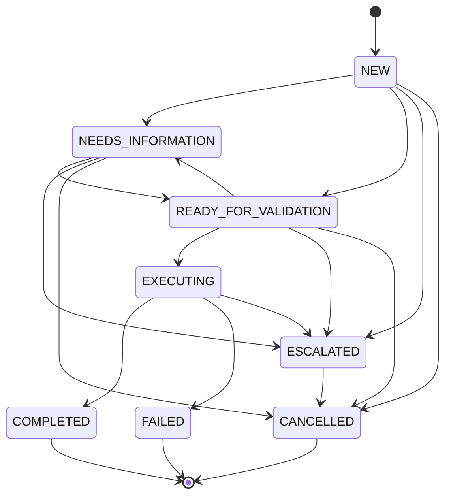
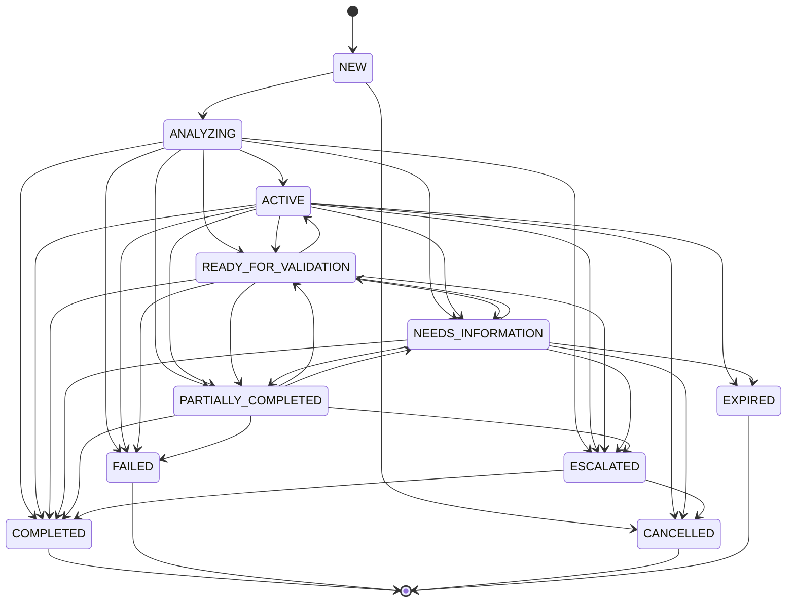
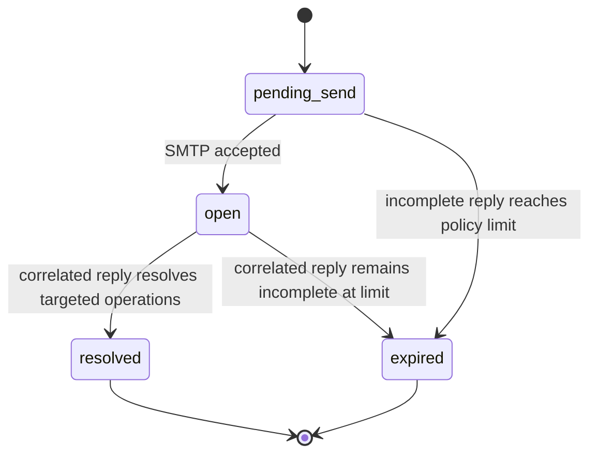
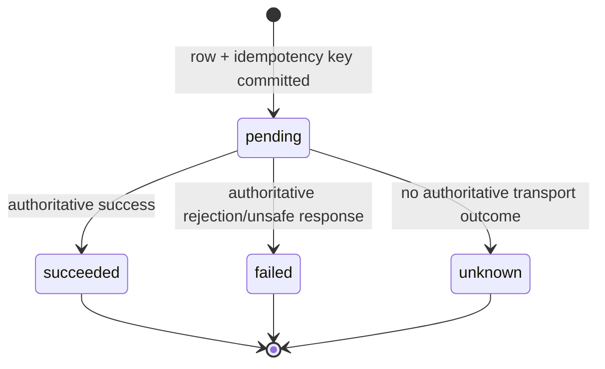
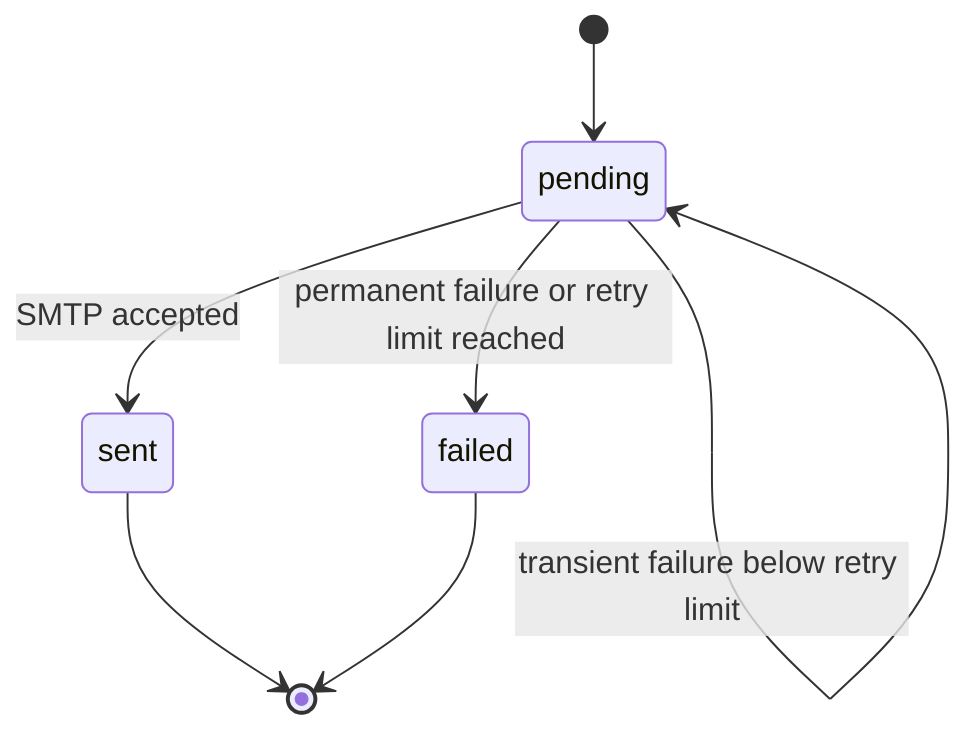
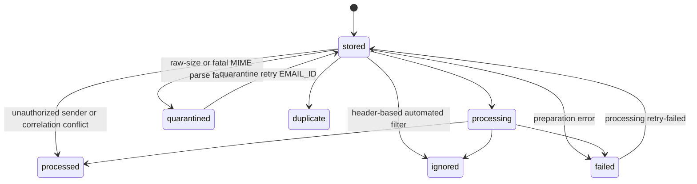

# Request and operation state machines

The workflow has several related state machines. `EmailMessage` tracks processing, `Operation` tracks one business action, `BusinessRequest` is an aggregate derived from its operations, `Clarification` tracks a question/reply cycle, `Execution` tracks an API outcome, and `OutboxMessage` tracks SMTP delivery. These states answer different questions and must not be collapsed into one status field.

The canonical enums are in `src/snoc_agent/domain/enums.py`; allowed request and operation transitions are in `src/snoc_agent/domain/state_machine.py`.

## Operation state machine

An operation is the unit of validation, execution, clarification, and idempotency.



The transition helper permits an idempotent assignment to the current state. All other transitions not shown above raise `InvalidStateTransition`.

### State meaning

| State | Meaning | Normal owner of the next transition |
|---|---|---|
| `NEW` | Persisted proposal has not yet received a final hybrid decision. | Analyzer/verifier workflow. |
| `NEEDS_INFORMATION` | Supported action is understood, but one or more deterministic required fields are absent. | A precisely correlated clarification reply or escalation policy. |
| `READY_FOR_VALIDATION` | Hybrid policy passed; the operation is eligible to enter the execution service. | Execution service only. |
| `EXECUTING` | A durable execution row and idempotency key have been committed and the business API call may be in flight. | Execution service or manual reconciliation after an interrupted call. |
| `COMPLETED` | The validated adapter returned an authoritative success. | Terminal in automatic workflow. |
| `FAILED` | Terminal known execution failure state in the domain matrix. | Human handling; the current API adapter normally escalates known failures instead. |
| `ESCALATED` | Automatic processing refused or API outcome requires human handling. It is terminal for summary purposes. | Human may cancel; an escalated request may later be administratively completed. |
| `CANCELLED` | Explicitly abandoned. | Terminal. |

`TERMINAL_OPERATION_STATUSES` includes `COMPLETED`, `FAILED`, `CANCELLED`, and `ESCALATED`. “Terminal” here means automatic workflow completion, not necessarily that a human has resolved the underlying support case.

### Decision-to-state mapping

| Hybrid decision | Operation effect | Other persisted effects |
|---|---|---|
| `AUTO_EXECUTE` | Moves to `READY_FOR_VALIDATION`, then execution moves it to `EXECUTING` and finally `COMPLETED` or `ESCALATED`. | `ValidationDecision`, `Execution`, and usually a terminal summary. |
| `ASK_FOR_INFORMATION` | Moves to `NEEDS_INFORMATION`. | Structured `Clarification`, outbound email, and outbox row. |
| `ESCALATE` | Moves any non-completed operation to `ESCALATED`. | Structured `Escalation` with proposal, verification, reasons, and hard invariants. |
| `REVIEW_CORRECTION` | Moves any non-completed operation to `ESCALATED`; an already completed operation remains completed. | Structured escalation for human correction review. |
| `IGNORE` | No business operation is materialized for an irrelevant/automated analysis. | Email becomes `ignored`. |
| `MARK_DUPLICATE` | Defined by the domain enum but deduplication occurs before model decisions. | Email becomes `duplicate`; no operation/API work. |

The hard-policy check refuses execution for unauthorized senders, weak/conflicting correlation,
schema failure, incomplete context after any configured size reduction, unknown action, invalid or
missing fields, model disagreement, contradiction, ambiguity, closed-history-only evidence, an
already executed revision, a closed/cancelled operation, or an unavailable execution mode/API.

### Canonical operation flows

Complete new operation:

```text
NEW -> READY_FOR_VALIDATION -> EXECUTING -> COMPLETED
```

Incomplete new operation:

```text
NEW -> NEEDS_INFORMATION
```

Clarification supplies all missing fields:

```text
NEEDS_INFORMATION -> READY_FOR_VALIDATION -> EXECUTING -> COMPLETED
```

Clarification remains incomplete at the configured limit:

```text
NEEDS_INFORMATION -> ESCALATED
```

Unsafe, contradictory, ambiguous, or uncorrelated proposal:

```text
NEW | NEEDS_INFORMATION | READY_FOR_VALIDATION -> ESCALATED
```

Known or unknown business API failure:

```text
READY_FOR_VALIDATION -> EXECUTING -> ESCALATED
```

The execution table distinguishes a known failure (`failed`) from a transport outcome that cannot be proven (`unknown`), even though both make the operation `ESCALATED`.

## Request state machine

A request is one business cycle in a conversation and owns one or more operations.



The transition matrix is the domain contract. Newly materialized requests are currently inserted directly as `ANALYZING`; the short-lived `NEW` state is not persisted during normal inbound processing.

### Aggregate derivation

After operation decisions/execution, `refresh_request_status` derives the request status in the following exact precedence order:

1. No operations: `ACTIVE`.
2. All operations `COMPLETED`: `COMPLETED`.
3. Any operation `NEEDS_INFORMATION`:
   - if any operation is `COMPLETED`: `PARTIALLY_COMPLETED`;
   - otherwise: `NEEDS_INFORMATION`.
4. Any operation `EXECUTING`: `ACTIVE`.
5. Any operation `READY_FOR_VALIDATION`: `READY_FOR_VALIDATION`.
6. Any operation `ESCALATED`:
   - if any operation is `COMPLETED`: `PARTIALLY_COMPLETED`;
   - otherwise: `ESCALATED`.
7. Any operation `FAILED`: `FAILED`.
8. Otherwise: `ACTIVE`.

Examples:

| Operation states | Derived request state |
|---|---|
| `COMPLETED` | `COMPLETED` |
| `COMPLETED`, `COMPLETED` | `COMPLETED` |
| `NEEDS_INFORMATION` | `NEEDS_INFORMATION` |
| `COMPLETED`, `NEEDS_INFORMATION` | `PARTIALLY_COMPLETED` |
| `COMPLETED`, `ESCALATED` | `PARTIALLY_COMPLETED` |
| `ESCALATED` | `ESCALATED` |
| `EXECUTING`, `COMPLETED` | `ACTIVE` |
| `READY_FOR_VALIDATION`, `NEW` | `READY_FOR_VALIDATION` |
| `FAILED` | `FAILED` |

Aggregate refresh validates every derived change through `assert_request_transition`, updates `last_active_at`, and increments the optimistic `version` when the state changes. The fallback maps an all-`CANCELLED` set to `ACTIVE`; cancellation/expiry administration is not yet implemented in the automatic worker and should not be inferred from that fallback.

### Request completion

When the derived state is `COMPLETED`, `completed_at` is set. A terminal summary is queued only when every operation is in one of:

```text
COMPLETED, ESCALATED, FAILED, CANCELLED
```

`requests.latest_completion_marker` prevents a second logical terminal summary. A mixed result such as `COMPLETED + ESCALATED` therefore receives one terminal summary while its aggregate state remains `PARTIALLY_COMPLETED`.

A completed request is never implicitly reopened. A new request in the same RFC chain receives a new request UUID and public reference while retaining the conversation UUID.

## Clarification state machine



Creation is transactional with the outbound email and outbox row. This prevents an SMTP retry from creating a second logical clarification.

The exact reply lookup only considers `pending_send` and `open`. A reply can arrive before the outbound row is marked sent and still correlate through its already-persisted RFC `Message-ID`.

`MAX_CLARIFICATION_ROUNDS` defaults to `1`. On the first incomplete request, one clarification is created. If a precisely correlated reply remains incomplete and the latest open round is already at the limit, waiting operations become `ESCALATED`, the clarification becomes `expired`, and `resolved_at` records the terminal time. If all waiting operations are resolved, the clarification becomes `resolved`.

There is no automatic transition from `resolved` or `expired` back to `open`.

## Execution state machine



The execution service commits `pending` and changes the operation to `EXECUTING` before the network call. This closes the duplicate-call window for normal retries: a second call for the same `<operation UUID>:<revision>` returns the existing record.

Results are interpreted as follows:

- HTTP adapter success requires a 2xx response, bounded response size, valid JSON matching the response schema, and explicit `success: true`.
- A transport error after allowed attempts produces `execution.status="unknown"` and escalates the operation. The service does not automatically issue another operation later.
- A non-success status, malformed/oversized response, or explicit unsuccessful response produces `execution.status="failed"` and escalates the operation.
- Mock/dry-run success produces `succeeded`, records `dry_run=true`, and completes the operation.

If the process dies after committing `pending` but before recording the response, the row may remain `pending` and the operation `EXECUTING`. That is a reconciliation incident, not permission to delete the execution row or create a new revision. See the runbook.

## Outbox state machine



On success, the linked outbound email becomes `processed`; a linked clarification becomes `open`. On failure, `retry_count` and `last_error` are updated. The default service limit is three failed attempts.

The enum includes `sending`, but the current synchronous sender does not set it. It loads only `pending` rows and does not claim them with row locks, so production should run one outbox sender until concurrent claiming is implemented. A failed row is not automatically returned to pending and requires controlled operator action.

SMTP acceptance and the database commit cannot be one atomic transaction. A crash after SMTP accepts but before the local commit can cause the same stored message, with the same RFC `Message-ID`, to be sent again. This is an at-least-once delivery boundary.

## Email processing state machine



Actual early outcomes are:

- automated/system mail: `ignored`, without request or operation creation;
- unauthorized sender: `processed` plus an escalation, without model/API work;
- physical/logical duplicate: `duplicate`, without correlation/model/API/outbox work;
- raw-size or fatal MIME parse failure: `quarantined`, with raw MIME and a safe error retained;
- correlation conflict: `processed` plus an escalation, without normal analyzer work;
- analyzer or unhandled workflow failure: `failed`, with raw MIME retained and a `processing_error:*` warning;
- verifier failure: operation `ESCALATED` plus an escalation; the email can still finish as `processed`.

Only `failed` emails are eligible for `processing retry-failed`. Quarantined rows are skipped by
normal polling and managed separately with `quarantine list` and
`quarantine retry EMAIL_ID`; a retry first returns the reviewed row to `stored` and may quarantine
it again if the raw-size or parser failure remains. `Processed`, `ignored`, and `duplicate` rows
are not reprocessed by either command.

## State ownership and manual changes

Operational tooling should respect these boundaries:

- do not mark an operation `COMPLETED` solely because an email was sent;
- do not mark an execution `succeeded` without authoritative API reconciliation evidence;
- do not delete or mutate an idempotency key to force a retry;
- do not reopen a resolved clarification by editing only its status;
- do not attach a request to a conversation based only on subject similarity;
- do not set a request aggregate without reconciling its operation states;
- preserve field revisions and the source email when a human corrects data.

The current CLI provides read-only request, operation, conversation, and failure inspection, but no general state-mutation command. Human resolution therefore needs a reviewed administrative procedure or a future dedicated reconciliation tool.
