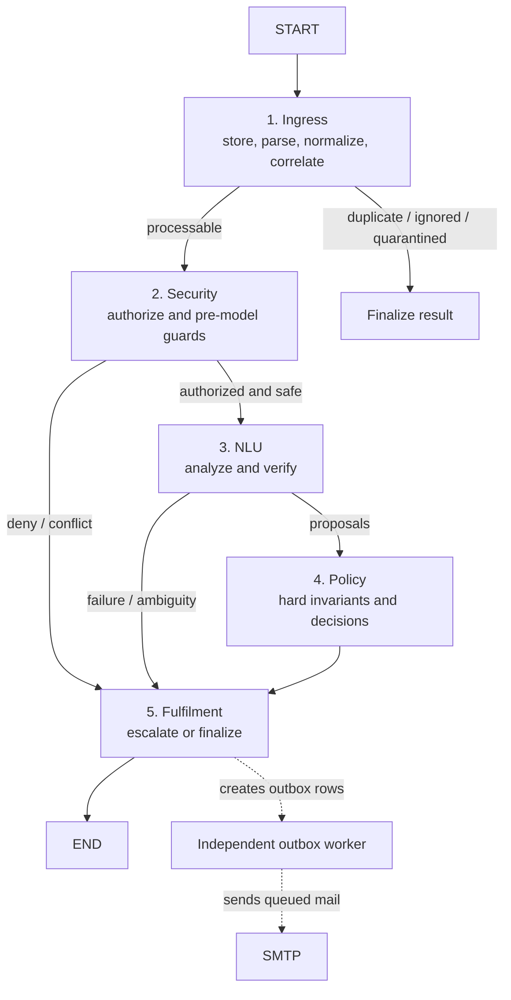

# LangChain and Five-Agent Migration Plan

## Decision

Use:

- **LangChain** for chat-model interfaces, messages, structured output, and runnable composition
- **LangGraph** for the deterministic workflow, conditional routing, checkpointing, and subgraphs
- the existing SQLAlchemy domain database as the authoritative business state and audit store

Do not turn every stage into an autonomous tool-calling LLM. In this safety-sensitive workflow,
“agent” means an independently owned graph component with an explicit typed contract. Only the NLU
agent uses models. Authorization, policy, endpoint selection, execution, and delivery remain
deterministic application code.

This corrects the premise in `message.md`: the current repository is a synchronous,
constructor-wired application with a large imperative `InboundProcessor`; it does not currently
depend on LangChain or LangGraph, and it does not have a separate event store or asynchronous
learning worker.

## Target topology



The graph is sequential at the stage level. Policy and fulfilment may process multiple operations
independently, but external side effects must remain idempotent and bounded.

## Shared graph contract

Create a JSON-serializable `WorkflowState` using `TypedDict` or a Pydantic model. Store identifiers
and bounded snapshots, never SQLAlchemy sessions/ORM objects, adapters, raw MIME, credentials, or
unbounded email history in graph state.

Minimum state:

```python
class WorkflowState(TypedDict, total=False):
    workflow_run_id: str
    inbound_email_id: str
    conversation_id: str | None
    request_ids: list[str]
    operation_ids: list[str]
    processing_status: str
    authorization: dict[str, object]
    correlation: dict[str, object]
    analysis: dict[str, object]
    verifications: dict[str, dict[str, object]]
    decisions: dict[str, dict[str, object]]
    execute_operation_ids: list[str]
    clarification_ids: list[str]
    escalation_ids: list[str]
    errors: list[dict[str, object]]
    graph_version: str
```

Rules:

1. Each agent accepts and returns a partial `WorkflowState` update.
2. Cross-agent contracts use current canonical names from `ai/schemas.py` and `domain/enums.py`,
   not the stale intent/entity examples in `message.md`.
3. Database writes happen through existing repositories/services and short transactions.
4. Graph routing reads explicit enum/status fields; it never parses free-form LLM reasoning.
5. Raw MIME and full model context stay in the existing database/audit chain.
6. Every state-changing node is safe to retry or guarded by an idempotency key.

## Ownership split for five agents/people

### 1. Ingress agent

Owns:

- `snoc_agent/mail/` parsing, reply segmentation, headers, markers, and IMAP identity
- pre-parse raw persistence and physical/logical deduplication
- conversation/request correlation mechanics
- quarantine and automated-message classification
- the `ingress` graph node/subgraph

Input: raw message plus `InboundIdentity`.

Output: stored `inbound_email_id`, processing status, bounded parsed metadata, and correlation
result.

Does not own sender authorization, model calls, policy, SMTP, or business API execution.

Initial extraction target from `InboundProcessor`:

- `_store_raw_minimal`
- `_apply_parsed`
- `_prepare` portions concerned with parsing, deduplication, automated mail, and correlation
- retry/quarantine entry logic

Acceptance tests:

- physical and logical replay is idempotent
- unsafe MIME is quarantined before model work
- RFC/marker correlation behavior is unchanged
- Gmail metadata remains optional

### 2. Security agent

Owns:

- `SenderAuthorizer`, static whitelist, and future LDAP adapter wiring
- sender normalization and authorization audit fields
- pre-model fail-closed checks
- correlation-conflict and malformed-identity security routing
- the `security` graph node/subgraph

Input: stored email ID and correlation result.

Output: an explicit authorization/security decision with reason codes and the next route.

The first migration must preserve the current static whitelist. LDAP integration is a separate,
feature-flagged change and must not be bundled into the graph rewrite.

Acceptance tests:

- unauthorized or malformed senders never reach NLU or the business API
- missing/failing LDAP adapter fails closed when LDAP is later enabled
- all deny/escalate reasons are persisted

### 3. NLU agent

Owns:

- prompt loading/versioning and bounded context construction
- analyzer and semantic verifier chains
- LangChain chat-model adapters for demo, OpenAI-compatible/vLLM, and Hugging Face routes
- strict `EmailAnalysis`, `ProposedOperation`, and `SemanticVerification` outputs
- model-run audit, cache compatibility, usage/cost capture, and provider fallback behavior
- the `nlu` graph subgraph

Recommended internal flow:

```text
build_context -> analyzer.with_structured_output(EmailAnalysis)
              -> verify each proposal with SemanticVerification
              -> persist model runs
```

Do not give the NLU model tools for authorization, SQL writes, endpoint selection, business API
calls, or SMTP.

Migration strategy:

1. Wrap the existing `EmailAnalyzer` and `SemanticVerifier` as LangChain `Runnable`s so behavior is
   unchanged.
2. Add a LangChain `BaseChatModel` adapter around the current `LLMBackend`, preserving audit/cost
   metadata and current JSON-schema fallback behavior.
3. Only after parity tests pass, evaluate direct provider integrations such as an OpenAI-compatible
   chat model or `langchain-huggingface`. Do not remove the existing backend until provider routing,
   retries, reasoning extraction, logprobs, and cost audits have equivalent coverage.

Acceptance tests:

- exact Pydantic schemas reject extra or incorrectly typed fields
- existing analyzer/verifier fixtures produce equivalent decisions
- model failure persists a failed `model_runs` row
- provider/model IDs, schema mode, usage, cost, and cache provenance are not lost

### 4. Policy agent

Owns:

- `HybridDecisionEngine`
- deterministic field validation, evidence/provenance checks, confidence gates, and status rules
- conditional edges from policy result to execute, clarify, escalate, ignore, or correction review
- the `policy` graph node/subgraph

Input: stored operation snapshots, analyzer proposals, verifier results, authorization and
correlation facts.

Output: one `DecisionResult` per operation plus explicit execution/clarification/escalation lists.

This agent must remain a pure deterministic component. It must not call an LLM, query external
systems, send mail, or mutate the business API.

Acceptance tests:

- all current decision-engine unit tests pass unchanged
- mixed multi-operation requests retain independent decisions
- no operation executes on ambiguity, conflict, failed evidence, prior execution, or invalid format
- graph conditional edges cover every `FinalDecision`

### 5. Fulfilment agent

Owns:

- operation materialization and request status aggregation
- `ExecutionService` and business API adapters
- clarification, escalation, reply-summary, and transactional outbox creation
- workflow finalization and failure recording
- the `fulfilment` graph subgraph

Input: IDs plus policy decisions; never an unconstrained model-selected endpoint or payload.

Output: execution, clarification, escalation and outbox IDs plus final processing/request statuses.

Keep physical SMTP delivery in the existing independent outbox worker. The graph creates durable
outbox rows but does not directly send mail. Preserve `operation UUID:revision` execution
idempotency before external I/O.

Acceptance tests:

- replay cannot duplicate a business mutation or outbound logical message
- unknown transport outcome escalates and is never blindly retried
- clarification replies resume through a new inbound graph invocation and existing domain state
- outbox retries do not repeat workflow decisions

## Proposed package layout

```text
src/snoc_agent/
  graph/
    state.py
    routes.py
    build.py
    persistence.py
    version.py
    agents/
      ingress.py
      security.py
      nlu.py
      policy.py
      fulfilment.py
  ai/
    langchain_adapter.py
    analyzer.py
    verifier.py
  workflow/
    ...existing services retained during extraction...
```

Each person owns one `graph/agents/<name>.py` module and the existing packages listed above.
Shared edits to `state.py`, `routes.py`, `build.py`, dependencies, configuration, and migrations go
through the rotating integrator described in `message.md`.

## Persistence and database plan

### Preserve two different kinds of state

1. **Domain state** remains authoritative in the existing SQLAlchemy tables: emails,
   conversations, requests, operations, revisions, model runs, decisions, executions,
   clarifications, escalations, and outbox.
2. **Graph checkpoint state** is only for orchestration recovery and inspection. Use a durable
   PostgreSQL LangGraph checkpointer in deployment and an in-memory or SQLite-compatible saver in
   tests.

Do not replace domain tables with LangGraph checkpoints. Checkpoints do not enforce the current
business constraints or provide the same audit model.

### Thread identity

- Before correlation, use a stable workflow run ID derived from the persisted inbound email ID.
- After correlation, retain explicit conversation/request IDs in graph state.
- Do not reuse Gmail thread ID as the LangGraph thread ID; it is optional and provider-specific.
- Serialize processing of the same business request, or apply the existing request `version` as an
  optimistic-concurrency guard.

### Optional workflow audit additions

If operations needs graph-level visibility beyond the existing audit chain, add in a separate
Alembic migration:

- `workflow_runs`: inbound email, graph version, thread ID, status, current stage, timestamps, and
  terminal error
- `workflow_events`: workflow run, sequence, agent/stage, event type, bounded JSON payload, and
  timestamp

Make `workflow_events` append-only at the application layer. Do not label the current database an
“event store” unless this append-only contract is actually implemented.

### Immediate schema prerequisite

Before graph development, migrate the checked-in SQLite database from `8bb4f2a91c7e` to
`f4a9c2d7e611`. The conditional reconciliation revision repairs provider metadata and any older
HF-audit/evaluation objects missing from historically stamped SQLite files.

## Delivery phases and gates

### Phase 0 — Baseline and architecture decision

1. Record representative replay outputs and database audit rows as golden fixtures.
2. Fix or explicitly quarantine the current unrelated test-baseline failure caused by the missing
   `labeled_data/labeled data/SMOLDATA_last_1000_reviewed.csv`.
3. Upgrade the checked-in SQLite schema to Alembic head after taking a backup.
4. Add an ADR explaining LangChain vs LangGraph roles and the deterministic-agent rule.
5. Add LangChain/LangGraph packages to `pyproject.toml`, resolve a compatible set, and lock the
   exact tested versions. Add the PostgreSQL checkpointer package only when its integration test is
   ready.

Gate: current non-live unit/integration suite is green or every pre-existing failure is documented.

### Phase 1 — Typed boundary extraction without changing orchestration

1. Define `WorkflowState` and per-agent input/output types.
2. Extract ingress, security, NLU, policy, and fulfilment facades from `InboundProcessor`.
3. Keep `InboundProcessor` calling those facades imperatively.
4. Add contract tests at every boundary.

Gate: replay/database snapshots match the baseline; no new provider or schema behavior.

### Phase 2 — LangGraph shadow graph

1. Build the five-component `StateGraph` with conditional routes.
2. Invoke it in shadow mode with external execution and SMTP disabled.
3. Compare graph decisions, state transitions, and persisted audits against the legacy path.
4. Add graph visualization and unreachable-route tests.

Gate: zero unsafe decision divergence on acceptance scenarios and approved equivalence for all
benign differences.

### Phase 3 — LangChain NLU adapters

1. Wrap current backends and schemas in LangChain model/runnable interfaces.
2. Migrate analyzer, then verifier, independently.
3. Preserve prompt versions, input hashes, schemas, raw output, fallback mode, usage, costs,
   logprobs, and failure audits.
4. Run offline evaluation and calibration comparisons.

Gate: no regression beyond agreed thresholds and zero increase in unsafe auto-execution.

### Phase 4 — Durable checkpointing and side-effect hardening

1. Add the production PostgreSQL checkpointer in a separate schema/table namespace.
2. Test crash/resume before and after every node.
3. Verify that execution and outbox side effects remain exactly-once logically.
4. Add concurrency tests for two emails targeting the same request.

Gate: forced process termination cannot duplicate API mutations or outbound logical messages.

### Phase 5 — Cutover

1. Run legacy and graph paths in shadow comparison in a staging mailbox.
2. Enable the graph path behind a feature flag by environment.
3. Canary one mailbox/account while retaining rapid rollback to the legacy orchestrator.
4. Remove the legacy imperative path only after the observation window and audit reconciliation.

Gate: operational metrics, audit completeness, latency, failure rate, and safety outcomes meet the
release criteria.

### Phase 6 — Optional follow-on work

- wire a real LDAP/AD adapter behind a separate feature flag
- add graph-level workflow events if the audit need is confirmed
- add human approval interrupts for decisions that require an operator
- add asynchronous learning/evaluation workers outside the inbound latency path

These are not prerequisites for the initial LangChain/LangGraph migration.

## Integration and merge protocol

Use the rotating integrator role proposed in `message.md`.

Integrator-owned files:

- `graph/state.py`, `graph/routes.py`, and `graph/build.py`
- dependency constraints and shared configuration
- Alembic revisions and checkpointer setup
- end-to-end and shadow-comparison tests

Merge order:

1. shared contracts
2. ingress and security extraction
3. policy and fulfilment extraction
4. NLU runnable wrappers
5. graph assembly
6. checkpointing
7. feature-flagged cutover

No agent branch may independently change shared state keys, enum string values, database columns,
or graph routes. Those changes require a contract update and integrator review.

## Definition of done

The migration is complete when:

- the production entry point uses the compiled graph
- all five components have explicit typed contracts and isolated tests
- only NLU has model access
- authorization and policy remain deterministic and fail closed
- business API and outbox idempotency survive graph retry/resume
- domain rows remain authoritative and auditable
- model audit/cost/cache information has not regressed
- PostgreSQL checkpoint recovery and same-request concurrency are tested
- legacy and graph paths have passed shadow comparison
- the legacy orchestration path can be removed without losing CLI, replay, evaluation, or dashboard
  behavior

## Official references

- [LangChain agents and structured output](https://docs.langchain.com/oss/python/langchain/agents)
- [LangChain model interfaces and custom base URLs](https://docs.langchain.com/oss/python/langchain/models)
- [LangGraph persistence](https://docs.langchain.com/oss/python/langgraph/persistence)
- [LangGraph subgraphs](https://docs.langchain.com/oss/python/langgraph/use-subgraphs)
- [LangGraph interrupts](https://docs.langchain.com/oss/python/langgraph/interrupts)
